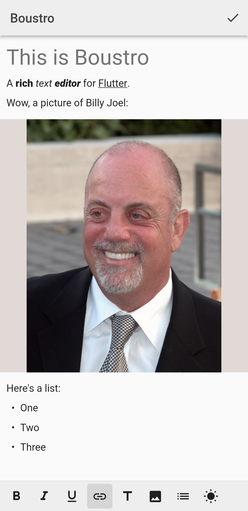
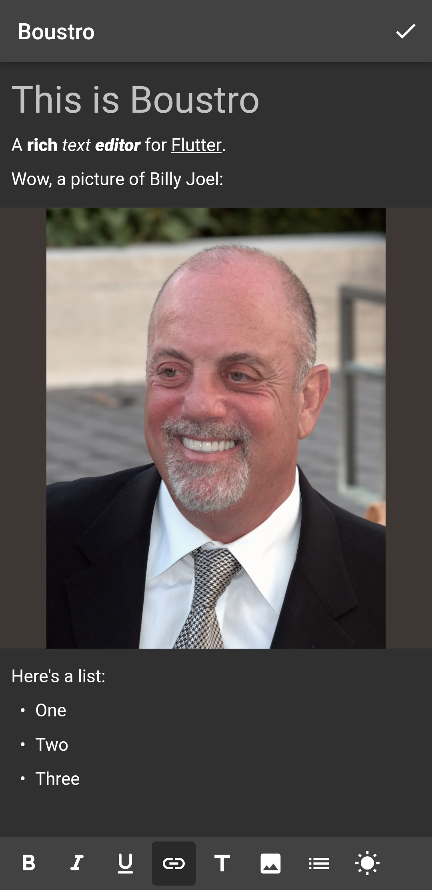

  
  

# boustro

Boustro is a rich text editor for Flutter.

## Features

### Easy to customize

Boustro is designed to be extremely customizable.
It provides the base infrastructure to implement any custom components in user code.
To be usable out of the box, boustro contains some built-in components that you'd
typically expect from a rich text editor.

Documentation on writing custom components has not yet been written. For now, check out the
implementation of the built-in components.

### Themeable with dark and light defaults

Boustro defines extensible theming classes that let users customize the base editor,
as well as any components implemented outside of boustro itself. These theme classes
even support lerping, for a nice animation when switching themes.
| Light  | Dark |
| ------ | ---- |
|  |  |

### Cross-platform

Boustro builds on Flutter's built-in text widgets, without any custom rendering or input handling,
so it runs on all platforms supported by Flutter.

## Getting Started

Check out the [docs](https://jjagg.dev/boustro) or the [example](packages/boustro/example).

### Glossary and Concepts

- **Document**: Immutable representation of a rich text document.
- **Paragraph**: Can be either a line of text or (non-inline) embed.
- **Line**: A line of text with rich formatting.
- **Embed**: Any content in a document that is not a Line.
- **Line modifier**: Wraps a line and can change the way it's displayed.
- **Text attribute**: Applied to text to set its formatting or add gesture recognizers.
- **Span**: Text range with a text attribute and rules for how the range behaves when text is inserted (whether it is expanded or not).

## Limitations

- Can't select across lines. I might be able to fix this issue and make line handling (newlines and
backspace at the start to delete lines) less hacky by using only a single `TextField`. However, this
would greatly complicate the line paragraph system, and I'm not sure that's worth it.
- At most 1 gesture per `TextSpan`. `TextSpan` can have a gesture recognizer,
but not multiple. We can solve this by using a `WidgetSpan` that wraps a `GestureRecognizer`, that wraps
the actual text span, but that's blocked by:
  - ~~[Support WidgetSpan in SelectableText](https://github.com/flutter/flutter/issues/38474)~~ **Fixed**
  - [Support WidgetSpan in EditableText](https://github.com/flutter/flutter/issues/30688)
- The same issues prevent me from creating inline embeds (e.g. inline images) using `WidgetSpan`. Please
go upvote these issues if you'd like to see these limitations overcome.

## Alternatives

- [Zefyr](https://github.com/memspace/zefyr): A big inspiration for this project.
- [Flutter-Quill](https://github.com/singerdmx/flutter-quill)

## Keep a Changelog + SemVer

The changelog documents all notable changes.

The format is based on [Keep a Changelog](https://keepachangelog.com/en/1.0.0/),
and this project adheres to [Semantic Versioning](https://semver.org/spec/v2.0.0.html).

